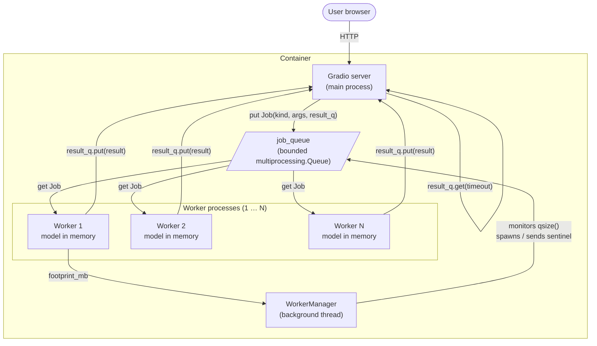

# Stegosaurus: neural linguistic steganography

**A technical overview of the algorithm and its implementation**


## 1. Overview

Stegosaurus hides an arbitrary user-supplied message inside generated cover text by exploiting the probability distributions produced by a large language model (LLM). At each step of text generation, the model's next-token distribution is partitioned into equal-probability bins. A chunk of the secret message selects which bin to sample from, and the highest-probability token in that bin is appended to the cover text. A recipient with the same model can reverse the process deterministically - no shared key or out-of-band metadata is required.

The approach is a discrete variant of the arithmetic-coding scheme introduced by Ziegler et al. (2019) in *Neural Linguistic Steganography*, simplified to greedy (argmax) sampling within each bin.


## 2. Algorithm

### 2.1 Message encoding

A UTF-8 string is serialized to a flat list of bits, MSB-first. An 8-bit end-of-message (EOM) marker - the byte `0xFF` - is appended after the message bits. Because `0xFF` is never a valid UTF-8 byte, it is an unambiguous sentinel regardless of message content. The decoder reads tokens until it sees `0xFF` at a byte boundary; no out-of-band length is required.


### 2.2 Top-k partitioning

At each generation step the model produces a probability distribution over its vocabulary. Stegosaurus restricts attention to the top-`k` tokens by probability (default `k = 20`), discarding the long tail.

These `k` candidates are partitioned into `n` bins (default `n = 2`, i.e. one bit per token) using a greedy equal-mass assignment: tokens are considered in descending probability order and placed into whichever bin currently holds the least total probability mass. This balances the bins as well as possible given the discrete token set.

Increasing `n` to 4 or 8 encodes 2 or 3 bits per token, producing shorter cover text at the cost of less freedom in token selection.

### 2.3 Token selection (encode)

The next `log2(n)` bits of the message are read as an integer index `i`. The highest-probability BPE-safe token in partition `i` is appended to the cover text. The extended sequence is fed back as context for the next step.

Once all message bits (including the EOM marker) have been encoded, generation continues greedily — always picking the highest-probability non-special token — until the cover text ends with a sentence-terminal character (`.`, `!`, or `?`), capped at 200 extra tokens. This prevents the cover text from cutting off mid-sentence without affecting the hidden payload.

### 2.4 Bit recovery (decode)

The decoder re-runs the identical partitioning on each cover token in sequence, using the same model and prompt as context. For each cover token it asks: which partition does this token belong to? That partition index re-encodes the original bit chunk. The loop stops when the recovered bit stream ends with `0xFF` at a byte boundary, which is guaranteed to occur exactly once - at the EOM marker.

### 2.5 BPE safety filter

Byte-pair encodings (BPE) can merge adjacent tokens during re-encoding: decoding `[A, B]` to a string and re-encoding it may yield `[C]` rather than `[A, B]`. If this happens, the decoder cannot recover the original token sequence from the cover text string, breaking the round-trip.

Before including a candidate token in any partition, Stegosaurus checks:

```python
decode([prev_id, candidate_id]) → re-encode → == [prev_id, candidate_id]?
```

Tokens that fail this check are silently excluded from all partitions. Because both encoder and decoder run the same filter, partition assignments remain identical.


## 3. Implementation

### 3.1 Modules

| File | Role |
|---|---|
| `src/stegosaurus.py` | Core encode/decode logic and CLI |
| `src/model_config.json` | Per-model tokenizer and loading configuration |
| `src/job.py` | `Job` dataclass shared between the Gradio process and worker processes |
| `src/worker.py` | Worker process entry point; loads model once, loops on `job_queue` |
| `src/manager.py` | `WorkerManager` thread; auto-scales the worker pool based on queue depth and memory budget |
| `demo/app.py` | Gradio web interface |

### 3.2 Model configuration

Rather than hardcoding model-specific behavior, `model_config.json` externalizes the parameters that differ across models:

| Field | Purpose |
|---|---|
| `default_prompt` | Seed text; must be identical for encode and decode |
| `bpe_check_add_special_tokens` | Whether to prepend BOS during the BPE safety check |
| `cover_add_special_tokens` | Whether to prepend BOS when tokenizing the cover text for decode |
| `trust_remote_code` | Passed to `from_pretrained`; `false` for all supported models |
| `memory_mb` | Estimated peak memory footprint for the model; used by `WorkerManager` to calculate the initial `max_workers` before the first worker reports its actual footprint |

Supported models: `google/gemma-3-1b-pt`, `Qwen/Qwen3-0.6B`, `Qwen/Qwen2.5-1.5B`, `Qwen/Qwen2.5-3B`, `meta-llama/Llama-3.2-3B`.

### 3.3 Lazy model loading

The model is loaded once per process and cached in module-level variables. Subsequent calls to `encode` or `decode` reuse the same model and tokenizer objects within the same process. Concurrency is handled by the worker pool (see section 5.3): each worker process has its own independent model copy, so no cross-process locking is needed.

### 3.4 KV cache

At each generation step, `_get_probs` passes `use_cache=True` to the model and carries `past_key_values` forward between calls. The prompt is processed in a single priming pass; each subsequent step feeds only the single new token, and attention over all prior positions is served from the cache rather than recomputed.

This reduces per-step compute from O(N) in context length to O(1), making the overall encode/decode loop O(N) rather than O(N²) in the number of generated tokens.

### 3.5 Capacity

With default settings (`top_k = 20`, `n_partitions = 2`), each generated token encodes exactly 1 bit. A 40-character ASCII message is 320 bits, plus 8 EOM bits = 328 tokens of cover text. Doubling `n_partitions` to 4 halves the token count; quadrupling to 8 gives 3 bits per token. Capacity scales with `log2(n_partitions)` but naturalness degrades as the model has less freedom to choose high-probability tokens.


## 4. Naturalness and detectability

Cover text naturalness depends on how tightly the partition bins are balanced and how large the vocabulary restriction (`top_k`) is. With a well-balanced two-partition split and `top_k = 20`, each selected token is among the model's most probable continuations, so the text reads naturally.

Statistical detectability is not formally analyzed here, but the BPE filter and greedy intra-partition selection mean every chosen token is always in the model's top-k, which limits statistical deviation from the model's baseline distribution. An adversary with access to the same model could in principle detect the signal by checking token partition membership, but this requires knowing the model, prompt, and hyperparameters.


## 5. Scaling considerations

### 5.1 Throughput bottleneck

Encoding and decoding are inherently sequential: each token requires a forward pass to compute the partition, and the next pass depends on the previous token. There is no mini-batch parallelism across tokens within a single encode/decode job.

The KV cache (section 3.4) ensures each step costs O(1) in context length, so the total work scales linearly with the number of tokens generated. The bottleneck is the sequential dependency, not recomputation. A 328-token encode on CPU takes ~30 seconds; on a T4 or L4 GPU it takes ~2 seconds.

### 5.2 Request concurrency

Because the model is held in memory and inference is sequential, a single worker process handles one request at a time. For a monolith deployment:

- **CPU**: one core is fully saturated for ~30s per request. Concurrency requires multiple processes, each loading the model independently (high memory cost).
- **GPU**: a single GPU worker handles one request at a time. Additional concurrent requests queue. Memory is occupied by the model (~3 GB for Qwen2.5-1.5B in bfloat16), leaving no room for batch parallelism within a 16 GB GPU anyway for a 1.5B model.

For low traffic, a single worker with a request queue is sufficient. A Gradio demo with `concurrency_count=1` is the simplest correct configuration.

### 5.3 In-process worker pool

The current implementation uses a worker pool within a single container. Each encode or decode request submitted through the Gradio UI is placed on a bounded `multiprocessing.Queue`; a pool of spawned worker processes (each owning its own model copy) drain the queue and write results back over per-job proxy queues.



- The Gradio server runs in the main process. Each button click submits a `Job` to the shared `job_queue` and blocks on a per-job `result_queue`.
- Worker processes each load the model once on startup and then loop, consuming jobs and writing results to a shared `response_queue`; a dispatcher thread in the main process routes each result to the correct per-job reply queue.
- The `WorkerManager` background thread polls the queue depth every `SCALE_INTERVAL` seconds and spawns or removes workers to match load, subject to the `MAX_MEMORY` budget.
- After loading, each worker reports its actual memory footprint so `WorkerManager` can refine the `max_workers` calculation.

### 5.4 Scaling out

To serve more concurrent users:

| Strategy | How | Tradeoff |
|---|---|---|
| Multiple CPU workers | Run N processes behind a load balancer | N x model RAM (~6 GB float32 each) |
| GPU worker pool | N GPU containers, each with dedicated VRAM | N x GPU cost |
| Async task queue | Celery + Redis; HTTP request returns a job ID, client polls | Extra infrastructure; enables user accounts, history |

The task-queue approach cleanly decouples the web frontend (stateless, cheap) from the GPU workers (stateful, expensive). This is the microservices architecture described in [deployment.md](deployment.md).

### 5.5 Model size vs. latency

Larger models produce more natural-sounding text but are slower and more memory-hungry. The default model is `Qwen/Qwen3-0.6B` (~1.5 GB VRAM in bfloat16, ~2.5 GB CPU RAM in float32), which balances quality and speed for a demo. The 1.5B Qwen2.5 model is a step up in quality and still fits on a modest GPU (~3 GB VRAM). A 7B model in bfloat16 requires ~14 GB for weights alone, which fits on a 16 GB T4 with limited headroom, or comfortably on a 24 GB GPU (L4, A10G). Expect roughly 5x the per-token latency of the 0.6B model.

### 5.6 Prompt sensitivity

Cover text quality and capacity are both sensitive to the prompt. A short, generic prompt gives the model broad stylistic freedom; a domain-specific prompt can produce more focused output but may reduce the effective vocabulary available for partitioning. The prompt is not part of the cover text and must be shared between encoder and decoder.


## 6. References

Ziegler, Z. M., Deng, Y., & Rush, A. M. (2019). *Neural linguistic steganography*. Proceedings of EMNLP-IJCNLP 2019. https://arxiv.org/abs/1909.01501
